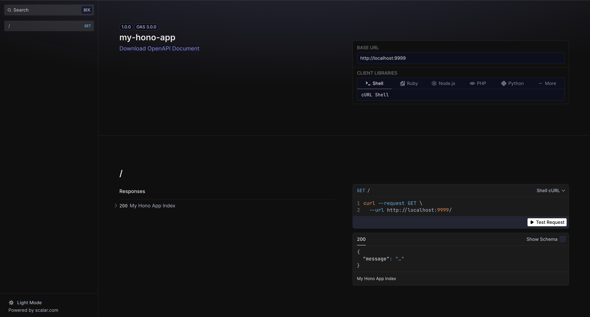
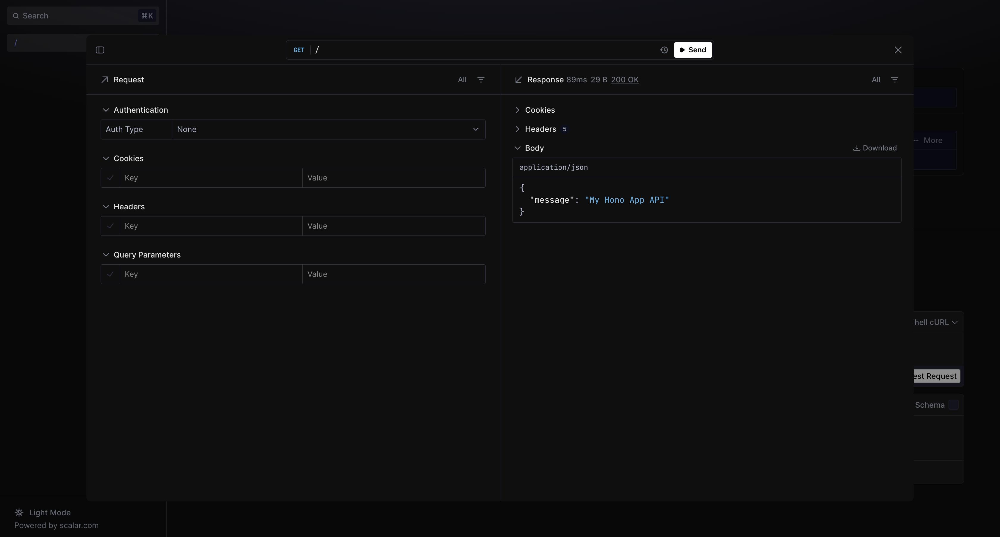

# My Hono App

## Description

Create another backend api using `hono` instead of `nodejs`

## Tech Stack

Here i am using :

- Hono
- Typescript
- pnpm
- another dependencies, you can find it on `package.json`

## Run the Application

Before run the application, first you've to install all of the dependencies, by open your terminal and type :

```bash
pnpm install
```

and then :

```bash
pnpm run dev
```

- open the root application, just open browser and type :

```bash
http://localhost:9999
```

- open the documentations, just open browser and type :

```bash
http://localhost:9999/reference
```

## Screen Captured

- The main Documentation Page :
  

- The API Client Page :
  

## Credits

[ivandjoh](https://linkedin.com/in/ivandjoh)
